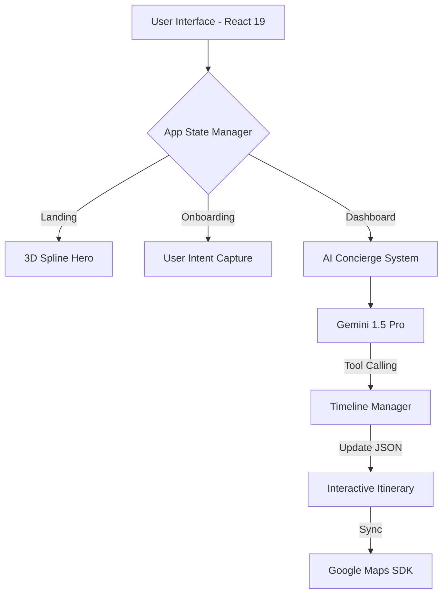
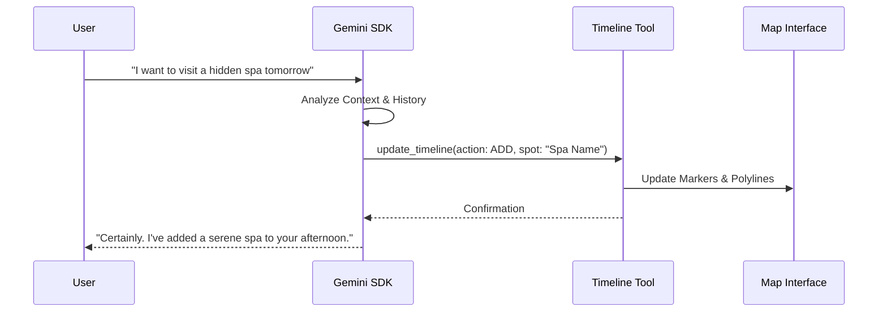

<div align="center">
  <h1 align="center">Veyra</h1>
  <p align="center">
    <strong>The Ultimate AI-Powered Luxury Travel Concierge</strong>
  </p>
  <p align="center">
    <i>Seamlessly blending artificial intelligence with high-end alpine luxury aesthetics.</i>
  </p>
</div>

---

## 🌟 Overview

Veyra is a sophisticated, AI-driven travel platform designed to provide a "Light Luxury" concierge experience. Inspired by the serene aesthetics of high-end alpine chalets like BelArosa, Veyra combines a stunning 3D immersive landing page with a powerful AI trip planning engine powered by Google Gemini.

Whether you're exploring the mountains or planning a curated local experience, Veyra anticipates your needs, modifies your itinerary in real-time, and offers exclusive local insights—all through a seamless conversational interface.

---

## ✨ Key Features

### 🏔️ Immersive Luxury Landing Page
- **3D Hero Section**: Features an interactive Spline scene for a modern, tactile first impression.
- **Responsive Aesthetics**: A curated palette of obsidian, taupe, and gold designed for a premium, high-contrast experience.
- **Modular Sections**: Dedicated blocks for Philosophy, Features (AI Itineraries, Real-time Access), and Benefits.

### 🤖 AI Concierge Dashboard
- **Gemini-Powered Intelligence**: Uses Google Gemini for context-aware, real-time itinerary generation and modification.
- **Autonomous Tool Calling**: The AI can directly modify your JSON itinerary timeline via function declarations.
- **Conversational Interface**: A sleek, minimal chat interface for natural language trip planning.

### 🗺️ Interactive Exploration
- **Luxury Map Styles**: Custom-themed Google Maps integration with curated markers for a cohesive look.
- **Dynamic Timeline**: A drag-and-drop style itinerary that stays perfectly synced with the AI assistant.

---

## 🏗️ Architecture & Frameworks

Veyra is built on a custom **Agentic Concierge Framework** that bridges high-end UI with autonomous AI logic.

### System Architecture


### AI Logic Flow


---

## 🛠️ Tech Stack

Veyra is built with a modern, modular architecture for maximum performance and scalability:

- **Frontend**: [React 19](https://react.dev/) + [Vite](https://vitejs.dev/)
- **Styling**: [Tailwind CSS](https://tailwindcss.com/)
- **3D Runtime**: [@splinetool/react-spline](https://spline.design/)
- **AI Agent**: [Google Gemini SDK](https://ai.google.dev/) with Function Calling
- **Motion**: [Framer Motion](https://www.framer.com/motion/)
- **Mapping**: [Google Maps SDK](https://developers.google.com/maps)
- **Icons**: [Lucide React](https://lucide.dev/)

---

## 📁 Project Structure

The project follows a modular component-based architecture:

```text
src/
├── components/
│   ├── landing/          # Luxury Landing Page components (Hero, Philosophy, etc.)
│   ├── ChatInterface.tsx # AI Chat logic and streaming
│   ├── MapPanel.tsx      # Custom themed Google Maps integration
│   ├── TimelinePanel.tsx # Itinerary management and display
│   └── TopBar.tsx        # Dashboard navigation
├── services/
│   └── gemini.ts         # AI configuration and tool calling logic
├── types.ts              # Global TypeScript definitions
├── App.tsx               # Main routing and state management
└── index.css             # Design system and global tokens
```

---

## 🚀 Getting Started

### Prerequisites
- Node.js (v18+)
- A Gemini API Key ([Get one here](https://aistudio.google.com/))
- A Google Maps API Key

### Installation

1. **Clone the repository:**
   ```bash
   git clone https://github.com/Hackmaass/Veyra.git
   cd Veyra
   ```

2. **Install dependencies:**
   ```bash
   npm install
   ```

3. **Set up environment variables:**
   Create a `.env` file in the root directory:
   ```env
   VITE_GEMINI_API_KEY=your_gemini_api_key
   VITE_GOOGLE_MAPS_API_KEY=your_google_maps_api_key
   ```

4. **Run the development server:**
   ```bash
   npm run dev
   ```

---

## 🛣️ Roadmap

- [ ] **Multi-party Sync**: Real-time collaborative trip planning for groups.
- [ ] **Offline Maps**: Cached map data for alpine exploration without connectivity.
- [ ] **Booking Integration**: Direct checkout for curated hotel and restaurant recommendations.
- [ ] **Voice Concierge**: Native voice interaction for hands-free planning.

---

## ⚖️ License

Distributed under the MIT License. See `LICENSE` for more information.

<p align="right">(<a href="#top">back to top</a>)</p>
